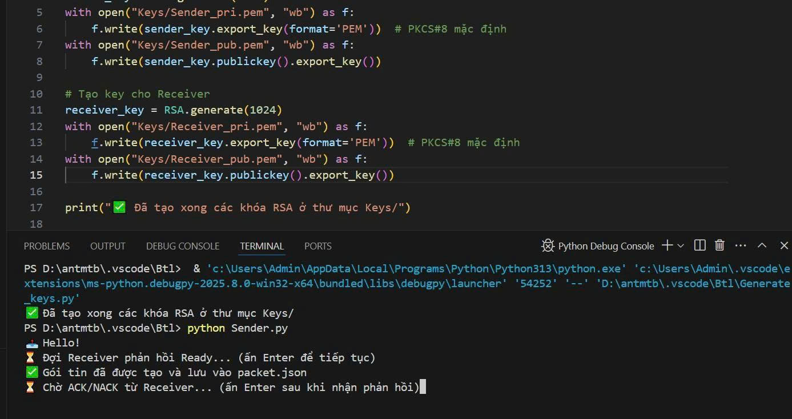
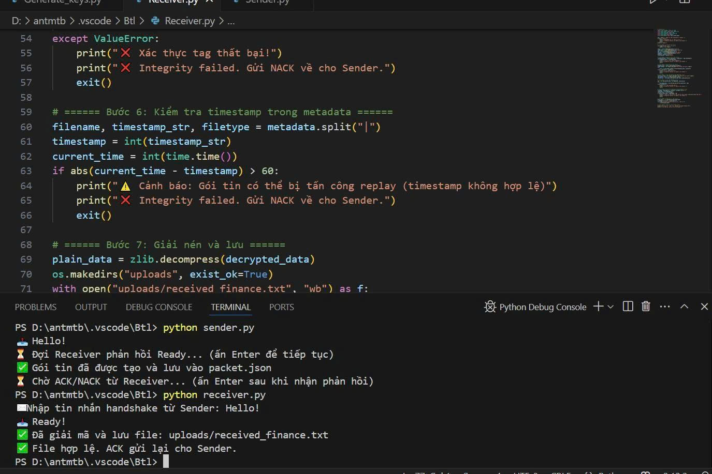
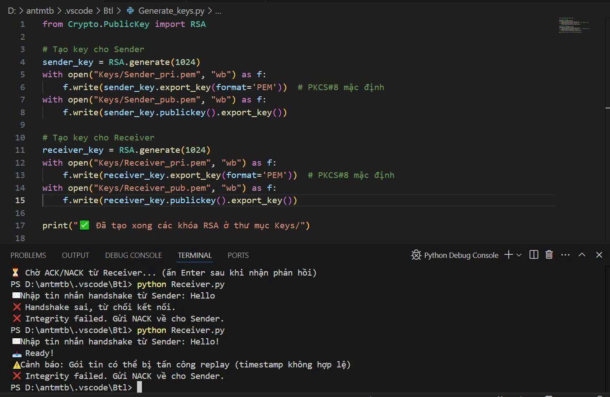

# Truyền file an toàn - Đề tài 10: Gửi báo cáo tài chính có nén dữ liệu
## Giới thiệu
Đây là một hệ thống bảo mật cho quá trình truyền file báo cáo tài chính giữa hai bên thông qua mạng Internet. Nội dung file được nén để giảm kích thước, sau đó mã hóa bằng thuật toán AES-GCM đảm bảo tính bảo mật và toàn vẹn dữ liệu. Danh tính của người gửi và người nhận được xác thực bằng chữ ký số RSA 1024-bit, đồng thời sử dụng hàm băm SHA-512 để kiểm tra toàn vẹn nội dung file.

Hệ thống mô phỏng theo mô hình thực tế khi một tổ chức cần gửi file dữ liệu tài chính quan trọng qua mạng với yêu cầu đảm bảo bí mật – toàn vẹn – xác thực trong toàn bộ quá trình truyền tải.

---

## Các kĩ thuật sử dụng

| Thành phần | Kỹ thuật |
|------------|----------|
| Mã hóa dữ liệu     | AES-GCM (Advanced Encryption Standard) |
| Nén dữ liệu       | 	zlib |
| Ký số   | RSA 1024-bit (PKCS#1 v1.5 + SHA-512) |
| Kiểm tra toàn vẹn   | SHA-512 |
| Giao diện | Command-line Python |
| Trao đổi khóa | RSA Public/Private Key |

---

## Luồng xử lí

### 1. Handshake
- Người gửi (Sender) gửi thông điệp: "Hello!"
- Người nhận (Receiver) xác nhận bằng thông điệp "Ready!"

### 2. Ký số và trao khoá
- Người gửi ký metadata {filename | timestamp | filetype} bằng RSA + SHA-512.
- Khóa phiên (session key) dùng cho AES được mã hóa bằng khóa công khai của người nhận.

### 3. Nén, mã khoá và kiểm tra toàn vẹn
- File finance.txt được nén bằng zlib.
- Mã hóa dữ liệu nén bằng AES-GCM.
- Sinh mã hash toàn vẹn bằng SHA-512 trên nonce, ciphertext và tag.
- Gói tin bao gồm:
```json
{
  "nonce": "<Base64>",
  "cipher": "<Base64>",
  "tag": "<Base64>",
  "hash": "<SHA-512 hex>",
  "sig": "<Base64 chữ ký số>",
  "enc_key": "<Base64 khóa phiên mã hóa bằng RSA>",
  "metadata": "Input/finance.txt|<timestamp>|text/plain"
}
```

### 4. Nhận và xác thực
  Người nhận kiểm tra:
- Chữ ký số trên metadata.
- Hash toàn vẹn nonce + ciphertext + tag.
- Giải mã khóa phiên bằng RSA.
- Giải mã dữ liệu bằng AES-GCM và giải nén.
- Kiểm tra timestamp để chống replay attack.
- Nếu hợp lệ: Giải mã thành công, ghép lại thành file gốc và gửi ACK.
- Nếu không hợp lệ: Gửi NACK, chỉ rõ nguyên nhân (hash sai, chữ ký sai, timestamp không hợp lệ...).

## Hướng dẫn sử dụng

### 1. Cài đặt môi trường
  Yêu cầu Python 3.10+
  Cài đặt thư viện cần thiết:

  ```bash
python -m pip install pycryptodome
```

### 2. Tạo khóa RSA cho người gửi và người nhận

```bash
python Generate_keys.py
```
Các khoá được tạo trong thư mục Keys/

### 3. Gửi file báo cáo ( người gửi)

```bash
python Sender.py
```
 - Đảm bảo file cần gửi nằm trong thư mục Input/finance.txt.
 - Gói tin sau khi mã hóa được lưu tại packet.json.

### 4. Nhận và giải mã file ( người nhận)
 Truy cập tab Người gửi 

 ```bash
python Receiver.py
```
- Tự động kiểm tra tính hợp lệ và lưu kết quả vào uploads/received_finance.txt.

### 5. Thông báo phản hồi khi nhận file hoặc lỗi timestamp

| Trường hợp | Thông báo trên dòng lệnh | Hành động yêu cầu người dùng |
| ---------- | ------------------------ | ---------------------------- |
| Handshake thành công | 📥 Ready! | Tiếp tục nhận file |
| Handshake sai | ❌ Handshake sai, từ chối kết nối. Gửi NACK. | Chạy lại và nhập đúng "Hello!" |
| Hash mismatch | ❌ Lỗi toàn vẹn! (hash mismatch). Gửi NACK. | Kiểm tra file và thử lại |
| Chữ ký không hợp lệ | ❌ Chữ ký không hợp lệ! Gửi NACK. | Kiểm tra khóa công khai |
| Timestamp không hợp lệ (lỗi thời gian) | ⚠️ Cảnh báo: Gói tin có thể bị tấn công replay. Gửi NACK. | Chạy lại, kiểm tra đồng hồ hệ thống |
| Giải mã thành công | ✅ Đã giải mã và lưu file. Gửi ACK. | Không cần hành động thêm |
| Tag AES không khớp (sai tag) | ❌ Xác thực tag thất bại! Gửi NACK. | Kiểm tra khóa phiên đúng sai |

👉 Khi có lỗi timestamp, bạn sẽ thấy thông báo:

 ```lesh
⚠️ Cảnh báo: Gói tin có thể bị tấn công replay (timestamp không hợp lệ)
❌ Integrity failed. Gửi NACK về cho Sender.
```

Người dùng cần nhập lại đúng handshake hoặc tạo lại gói tin mới để đảm bảo timestamp chính xác.

## Giao diện bài

Ứng dụng chạy trên dòng lệnh (Command-line) với các thông báo đơn giản:

### 1. Người gửi


### 2. Người nhận


## Ví dụ phản hồi ACK / NACK

### 1. ACK


### 2. NACK



---

## Thành viên thực hiện

Trường: Đại học Đại Nam

Lớp: Công nghệ thông tin 16-04

Nhóm: Nhóm 10

Danh sách thành viên:
- Vũ Hải Đức
- Nguyễn Thế Vinh
- Trịnh Hữu Hiệu


